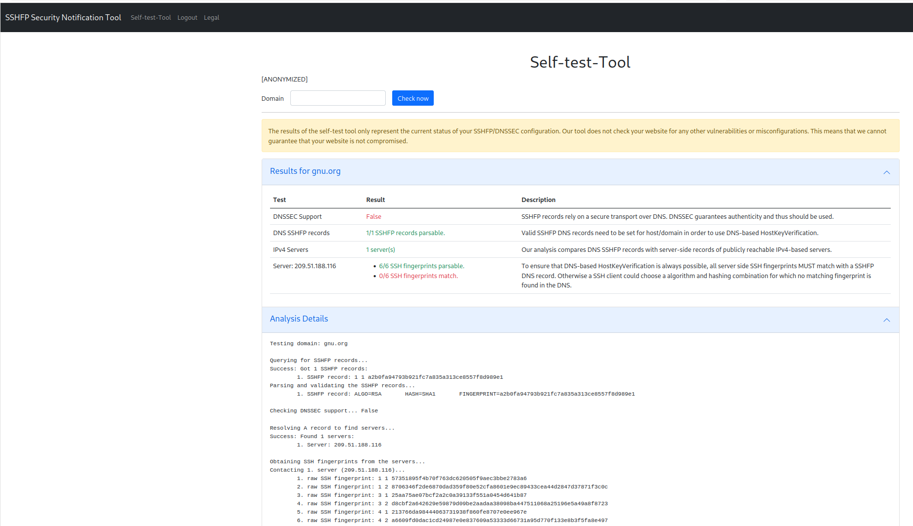

Selftest Tool
============

This tool was developed as part of our SSHFP Notification Study to allow users to verify their misconfiguration and later mitigation.

Each notified person was assigned a randomly generated `token` (in `tokens.json`) with which they were allowed to use the tool to test the set of domains belonging to them, which we identified to be misconfigured. The interactions with the website and the scan results were collected in a pseudo-anonymized way for our survival analysis of the misconfigurations and some statistics on the tool's usage and effectiveness. 

Furthermore, the tool allows to define a set of blocked IP address ranges as well as a rate-limit to mitigate misuse against internal or external infrastructure.



# Usage:
Depending on the deployment strategy (plain docker (compose) or kubernetes), you will use different configuration files. This README covers the plain docker compose way, which requires `docker` and `docker compose` and a web server of your choice (e.g. Apache2, NGINX or Caddy) to be installed on your system.

- Rename `environemnt-web.env.sample` to `environment-web.env` and replace
	- `[YOURLEGALPAGE]` with a link to your legal/imprint page
	- `[YOURSTRONGPASSWORD]` with a strong password used for basic authentication
	- Adjust the list of blocked networks by appending new CIDR-networks with a comma.
	- Adjust the rate limit of allowed tests per token
- Run `docker compose build`
- Rename the `tokens.json.sample` in `image-web/app/` to `tokens.json`
- Define tokens that serve as a password to the web application. Tokens are assigned one or more domains to which they belong, and a set of subdomains that are allowed to be scanned. The web application checks the the entered token ID against the keys of the dictionary (`secrettoken1`)
```
    "secrettoken1": {
      "ids": [
        "DOMAIN1.TLD",
        "DOMAIN2.TLD",
      ],
      "domains": [
        "DOMAIN1.TLD",
        "SUB1.DOMAIN1.TLD",
        "DOMAIN2.TLD",
        "SUB2.DOMAIN2.TLD",
      ],
      "group": "tool"
    }
```
- Clear the `image-web/app/interactions.log` with `$> > image-web/app/interactions.log`
- You might want to adjust the FAQ data or the `[ANONYMIZED]` placeholders in the `image-web/app/templates/*` and `image-web/app/languages/*` files
- Run `sudo docker compose up -d`
- Configure your web server to redirect traffic to `127.0.0.1:8000` for the public selftest tool, and to `127.0.0.1:8001` in a basic-authentication secured way for the internal `interactions.log` retrieval (see `configs/Caddyfile`).
	- Hint: Get a SSL/TLS certificate for the domain under which the tool is to be available. 
- Apply the `configs/iptables-rules.sh` IPtables rules with `sudo iptables-apply configs/iptables-rules.sh` to protect your and specific other networks from the tool's SSH traffic.
- You should now be able to reach the page either at `127.0.0.1:8000` or your configured domain through your webserver.

- The `interactions.log`, which contains the users' interactions with the selftest-tool is stored in the `web-data/` directory. 